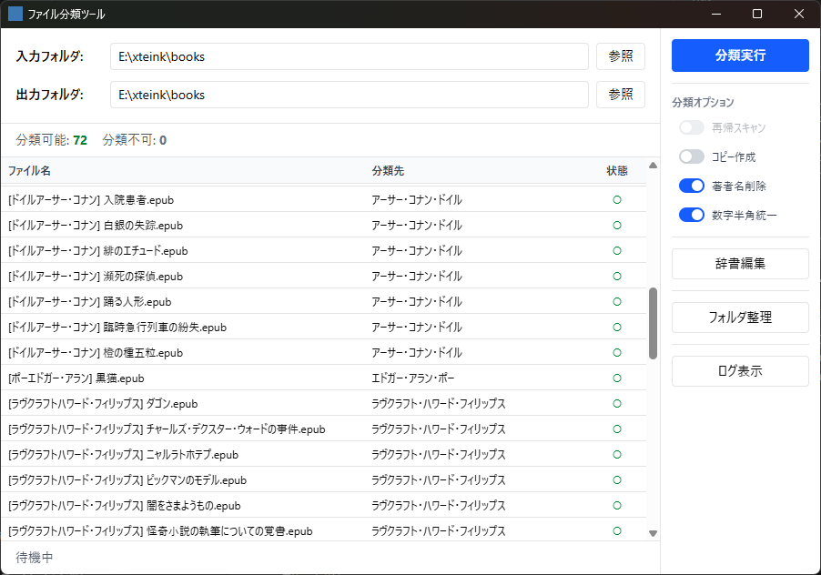

# FileClassifier - ファイル分類ツール

ファイル名の `[タグ名]` パターンに基づき、辞書を参照してフォルダへ自動分類するWindowsデスクトップアプリです。
日本語の作者名・サークル名でのファイル整理を主な用途としています。

## 主な機能

- **自動分類** — `[著者名] 作品名.zip` のようなファイルを著者名フォルダへ自動振り分け
- **辞書による表記ゆれ吸収** — 類似名称を同一フォルダに統合（カタカナ/ひらがな、全角/半角、漢数字 等）
- **プレビュー** — 分類実行前に結果をリアルタイムプレビュー。分類先のインライン編集も可能
- **辞書の自動学習** — 未登録のタグは自動的に辞書に追加。類似名の既存フォルダがあればそちらに統合
- **フォルダ整理** — 類似フォルダの統合、少数ファイルフォルダのグルーピング
- **高速** — 1万ファイル以上でも仮想スクロールで軽量に動作

## スクリーンショット



## 動作環境

- Windows 10 (21H2以降) / Windows 11
- WebView2 ランタイム（Windows 10/11 に標準搭載）

## インストール

[Releases](../../releases) ページから `FileClassifier.exe` をダウンロードし、任意のフォルダに配置してください。
インストーラーは不要です。設定ファイル・辞書ファイルはEXEと同じフォルダに自動生成されます。

## 使い方

### 基本的な流れ

1. `FileClassifier.exe` を起動
2. 入力フォルダ（分類対象のファイルがあるフォルダ）を指定
3. 出力フォルダ（分類先の親フォルダ）を指定
4. プレビューで分類結果を確認
5. 必要に応じて分類先をクリックして編集
6. 「分類実行」をクリック

### タグの書式

ファイル名の最初の `[` と `]` の間の文字列がタグとして認識されます。

```
[著者名] 作品タイトル.zip  →  著者名/ フォルダに分類
[サークル名 (作者A, 作者B)] 作品名.pdf  →  サークル名 (作者A, 作者B)/ フォルダに分類
```

`Main(Sub1, Sub2)` 形式のタグは、フルネーム・メイン名・各サブ名のいずれでもマッチするよう辞書に登録されます。

### 分類オプション

| オプション | 説明 |
|---|---|
| 再帰スキャン | 入力フォルダのサブフォルダも対象にする |
| コピー作成 | ファイルを移動ではなくコピーする |
| 著者名削除 | 分類先ファイル名から `[タグ]` 部分を除去する |
| 数字半角統一 | 全角数字を半角に変換する |

### 辞書

辞書は `folder_dictionary.json` としてEXEと同じフォルダに保存されるプレーンなJSONファイルです。

```json
{
  "正規化キー": "分類先フォルダ名"
}
```

- アプリ内の辞書編集画面で編集可能
- 外部テキストエディタで直接編集も可能
- 既存のフォルダ構成から辞書を自動生成する機能あり（フォルダ名に加え、フォルダ内のファイル名からもタグを抽出してキーに追加）

## ビルド方法

### 前提条件

- [Node.js](https://nodejs.org/) (v18以上)
- [Rust](https://www.rust-lang.org/tools/install) (stable)
- [Tauri CLI の前提条件](https://v2.tauri.app/start/prerequisites/)

### ビルド手順

```bash
# 依存パッケージのインストール
npm install

# EXEビルド（release/ にコピーされます）
npm run tauri:build
```

### テスト

```bash
# Rustユニットテスト
cd src-tauri && cargo test

# TypeScript型チェック
npx tsc --noEmit
```

## プロジェクト構成

```
FileClassifier/
├── README.md                  # 本ファイル
├── CLAUDE.md                  # Claude Code用のプロジェクトガイド
├── LICENSE                    # MITライセンス
├── requirements_definition.md # 要件定義書（日本語）
├── package.json               # Node.js依存関係・ビルドスクリプト
├── package-lock.json          # 依存関係のロックファイル
├── tsconfig.json              # TypeScript設定
├── vite.config.ts             # Vite設定（開発サーバー・ビルド）
├── index.html                 # エントリーHTML
├── icon.png                   # アプリアイコン原画
├── screenshot.png             # README用スクリーンショット
├── .gitignore                 # Git除外設定
│
├── src/                       # フロントエンド（React + TypeScript）
│   ├── main.tsx               # エントリーポイント
│   ├── App.tsx                # ルートコンポーネント（画面遷移管理）
│   ├── index.css              # グローバルスタイル（Tailwind CSS）
│   ├── vite-env.d.ts          # Vite型定義
│   ├── lib/
│   │   ├── types.ts           # 共通型定義（Settings, DryRunResult等）
│   │   └── api.ts             # Tauriコマンド呼び出し（バックエンドRPC）
│   └── components/
│       ├── MainWindow.tsx     # メインウィンドウ（設定・プレビュー・アクション）
│       ├── PreviewTable.tsx   # プレビューテーブル（仮想スクロール・インライン編集）
│       ├── DictionaryEditor.tsx   # 辞書編集画面
│       ├── FolderCleanupDialog.tsx # 出力フォルダ整理ダイアログ
│       └── LogViewer.tsx      # 処理ログ表示画面
│
├── src-tauri/                 # バックエンド（Rust + Tauri v2）
│   ├── Cargo.toml             # Rust依存関係
│   ├── Cargo.lock             # Rust依存関係ロックファイル
│   ├── build.rs               # Tauriビルドスクリプト
│   ├── tauri.conf.json        # Tauri設定（ウィンドウ・バンドル・プラグイン）
│   ├── capabilities/
│   │   └── default.json       # Tauriパーミッション設定
│   ├── icons/
│   │   ├── icon.ico           # Windowsアイコン（複数サイズ）
│   │   ├── 32x32.png          # タスクバー用アイコン
│   │   └── 128x128.png        # 高解像度アイコン
│   └── src/
│       ├── main.rs            # アプリエントリーポイント
│       ├── lib.rs             # モジュール定義・Tauriアプリ初期化
│       ├── types.rs           # 共通型（Settings, DryRunResult, MatchType等）
│       ├── commands.rs        # Tauriコマンドハンドラ（フロントエンドAPI）
│       ├── classifier.rs      # ファイルスキャン・分類ロジック・ドライラン
│       ├── dictionary.rs      # 辞書の読み書き・グループ化ルール
│       ├── normalize.rs       # 文字列正規化（NFKC・類似判定用）
│       ├── similarity.rs      # 類似フォルダ検出（BFSクラスタリング）
│       ├── tag.rs             # タグ抽出・サニタイズ・ファイル名補正
│       ├── settings.rs        # 設定ファイルI/O
│       └── fs_utils.rs        # ファイル操作ユーティリティ（衝突回避・パス検証）
│
└── scripts/
    ├── copy-release.mjs       # ビルド後にEXEをrelease/へコピー
    └── generate-icons.mjs     # icon.pngからICO/PNG各サイズを生成
```

## 技術スタック

| レイヤー | 技術 |
|---|---|
| フレームワーク | [Tauri v2](https://v2.tauri.app/) |
| バックエンド | Rust |
| フロントエンド | React + TypeScript |
| UI | Tailwind CSS |
| 仮想スクロール | TanStack Virtual |

## ライセンス

MIT License
